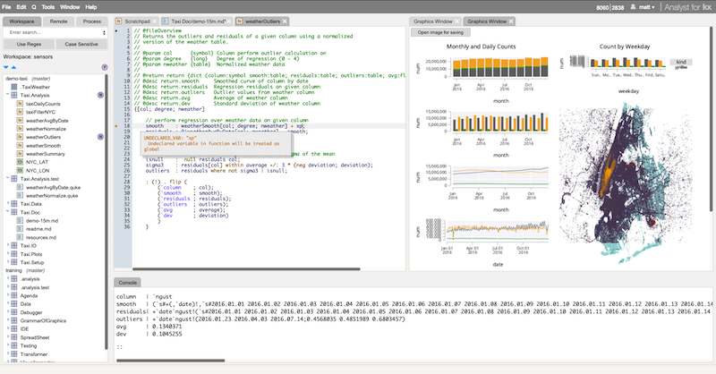
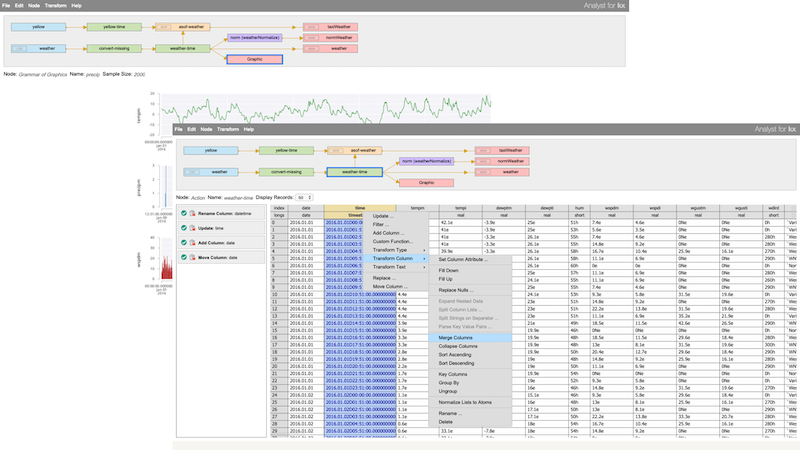
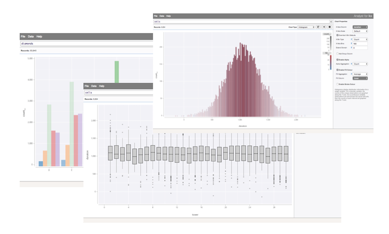
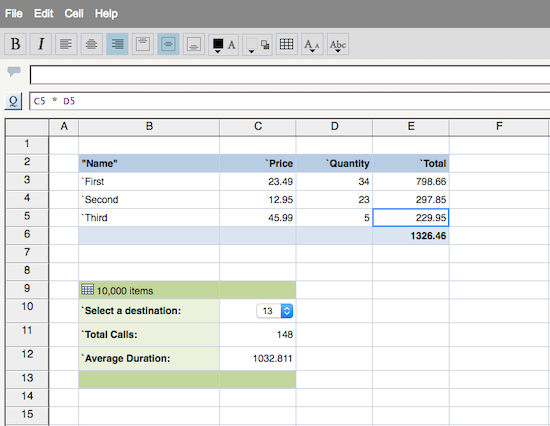
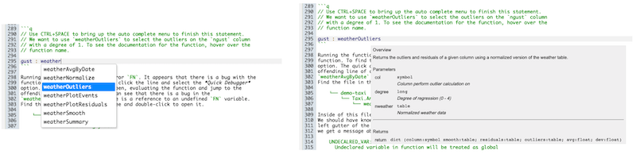
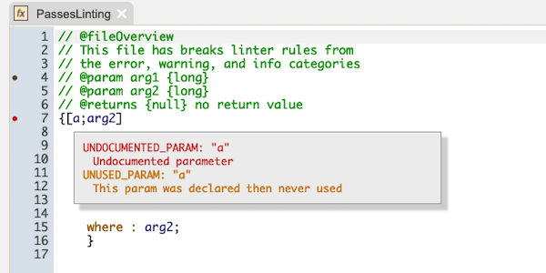
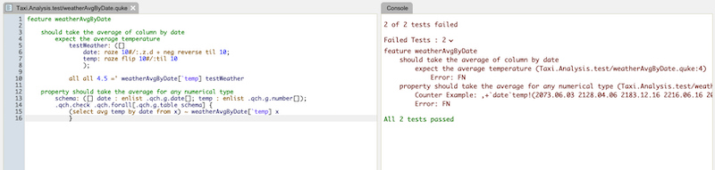
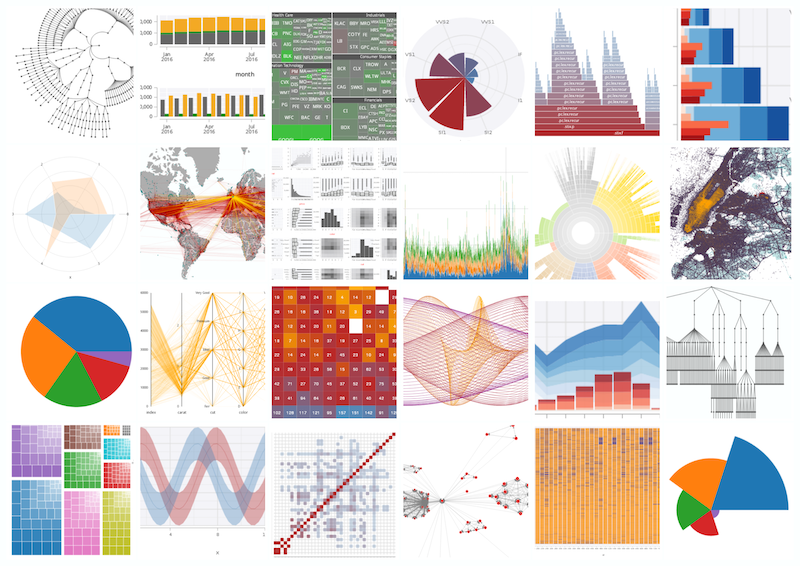

Kx Analyst Training
===================

Getting Kx Analyst & Kx Developer
---------------------------

Kx Developer can be downloaded from the 
[Developer getting started](https://code.kx.com/developer/getting-started/) page.
Kx Analyst can be accessed following the instructions on the the
[Analyst getting started](https://code.kx.com/analyst/getting-started/) page.

Once downloaded, extract the tool and install it following the instructions provided in
the `README.md` file included.

What's New in Analyst & Developer
---------------------------------

**General**:

- **Remote Editor** connection search, favorite, and filter
- Ability to toggle the Sidebar within the IDE (Windows > Toggle Sidebar)
- Accessibility improvements throughout
- General fixes and performance improvements

**Libraries**:

- Conditional feature skip with `skip if` block in **qcumber**
- `qcumber.q_` unit testing library reporting and usability improvements
- `qlint.q_` linting library now checks for `lint.config` files on disk
- `qlint.q_` exits with code `1` if there are *error* class issues

And many more. Check the [release notes](https://code.kx.com/analyst/release-notes) for the full list.

Getting this repository
-----------------------

This repository can be cloned directly into Kx Analyst or Kx Developer. Right-click the
workspace area on the left of the page and select `Git > Clone...`. In the dialog, enter
the URL for the training repository `https://github.com/kxsystems/analyst-training.git`.
Pressing `OK` will open the `Pull Repository` dialog with the option to select a name
and branch for the repository. Press `OK` to finish cloning the repository.

Organization
------------

The training module is separated into two parts. Section A contains a tutorial and walkthrough
of this tool using some simulated data. The walkthrough can be found under in the 
`walkthrough.md` file under `A.Tutorial.Doc`. A guided version of the walkthrough is also 
available on [code.kx.com](https://code.kx.com/analyst/data-analysis-walkthrough/).

    └── training
        └── A.Tutorial.Doc
            └── walkthrough.md
            
Section B focuses on more specific features of this tool. To find out more about
any particular component within this tool, look at the section of interest under 
the desired module `B.Section.<Component>`.

Resources
---------

For more resources, please refer to the following links.

### Kx Analyst

- [Kx Analyst home](https://kx.com/solutions/the-enterprise/analyst/) - Full featured interactive development environment for q and kdb+
- [Kx Analyst user guide](https://code.kx.com/analyst/) - Product documentation and example use cases

#### Visual Data Transformer and Query

- (*blog*) [Kx Product Insights: Modern Data Preparation (ETL) in Kx Analyst](https://kx.com/blog/kx-product-insights-modern-data-preparation-etl-in-analyst-for-kx/)
- (*video*) [Data Transformer overview](https://vimeo.com/183895691)
- (*video*) [Filtering data without programming using the Transformer](https://vimeo.com/184708019)

#### Visualization

- (*blog*) [Visualization for exploratory data analysis](https://kx.com/blog/kx-product-insights-visualization-for-exploratory-data-analysis-eda/)
- (*video*) [Visual Inspector overview](https://vimeo.com/183886181)
- (*video*) [Custom Graphics with q Visualization Library](https://vimeo.com/212133060)

#### Spreadsheet

- (*video*) [Spreadsheet overview](https://vimeo.com/183891867)

### Kx Developer

- [Kx Developer user guide](https://code.kx.com/developer/) - Product documentation and example use cases

#### IDE

- (*blog*) [Kx Product Insights: IDE Overview](https://kx.com/blog/kx-product-insights-analyst-for-kx-ide/)
- (*blog*) [Integrating Python and kdb+ to detect suspicious logins](https://kx.com/blog/integrating-python-and-kdb-to-detect-suspicious-logins/)
- (*video*) [IDE overview](https://vimeo.com/239703330)

#### Testing

- (*blog*) [Kx Product Insights: Testing with qCumber and QuickCheq](https://kx.com/blog/kx-product-insights-testing-using-analyst-for-kx/)
- (*video*) [Testing with qCumber and QuickCheq](https://vimeo.com/221903630)
- (*video*) [Behavioural Driven Development](https://vimeo.com/183916767)

### Libraries

- (*website*) [Libraries home](https://code.kx.com/analyst/libraries/)
- (*blog*) [Kx Product Insights: AxLibraries and Q Build Utilities](https://kx.com/blog/code-development-documentation-linting-testing-kx-analyst/)

### Demos

- (*video*) [Kx Developer and Kx Analyst: Live demo of a data driven project using taxi data](https://www.youtube.com/watch?v=o3Sg_RHnUdw)
